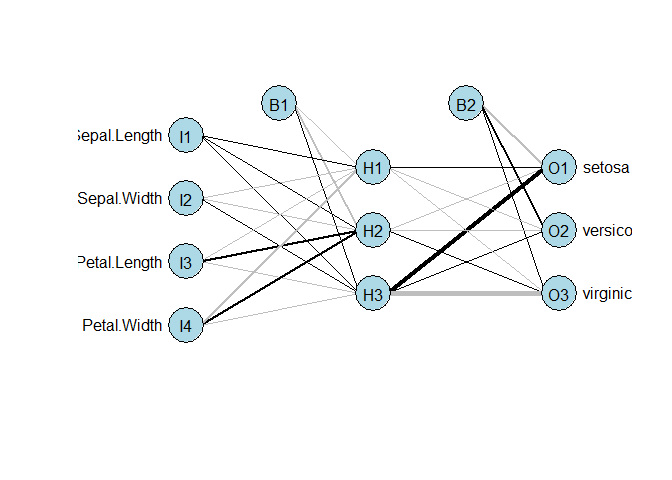

## 01. Load libraries

```r
library(caret)
```

```
## Warning: package 'caret' was built under R version 3.4.4
```

```
## Loading required package: lattice
```

```
## Loading required package: ggplot2
```

```
## Warning: package 'ggplot2' was built under R version 3.4.4
```

```r
library(nnet)
```

```
## Warning: package 'nnet' was built under R version 3.4.4
```

## 02. Partition of the iris data into trainnig and test data

```r
set.seed(0)
idx <- createDataPartition(iris$Species, p=0.7, list=F)
iris_train <- iris[idx, ]
iris_test <- iris[-idx, ]
```


```r
table(iris_train$Species)
```

```
## 
##     setosa versicolor  virginica 
##         35         35         35
```

```r
table(iris_test$Species)
```

```
## 
##     setosa versicolor  virginica 
##         15         15         15
```

## 03. standardization 

```r
iris_tr_scale <- as.data.frame(sapply(iris_train[-5], scale))
iris_test_scale <- as.data.frame(sapply(iris_test[-5], scale))
```


```r
iris_tr_scale$Species <- iris_train$Species
iris_test_scale$Species <- iris_test$Species
```

## 04. Data modeling

```r
iris_model <- nnet(Species~., data=iris_tr_scale, size=3)
```

```
## # weights:  27
## initial  value 132.248687 
## iter  10 value 20.314032
## iter  20 value 5.771669
## iter  30 value 4.979497
## iter  40 value 4.950622
## iter  50 value 4.948813
## iter  60 value 4.947607
## iter  70 value 4.938868
## iter  80 value 4.933039
## iter  90 value 4.926966
## iter 100 value 4.926473
## final  value 4.926473 
## stopped after 100 iterations
```


```r
summary(iris_model)
```

```
## a 4-3-3 network with 27 weights
## options were - softmax modelling 
##  b->h1 i1->h1 i2->h1 i3->h1 i4->h1 
##  -2.28   0.15  -4.44 -13.77 -18.96 
##  b->h2 i1->h2 i2->h2 i3->h2 i4->h2 
## -23.46   1.77 -15.14  19.51  25.27 
##  b->h3 i1->h3 i2->h3 i3->h3 i4->h3 
##   0.13   0.69   0.13  -2.67  -1.64 
##  b->o1 h1->o1 h2->o1 h3->o1 
## -27.22   4.22 -10.85  62.69 
##  b->o2 h1->o2 h2->o2 h3->o2 
##  21.39  -3.32  -6.39  11.36 
##  b->o3 h1->o3 h2->o3 h3->o3 
##   5.17  -0.24  17.31 -73.95
```

## 05. nnet model visualization

```r
library(devtools)

# import the function from Github
source_url('https://gist.githubusercontent.com/Peque/41a9e20d6687f2f3108d/raw/85e14f3a292e126f1454864427e3a189c2fe33f3/nnet_plot_update.r')
```

```
## SHA-1 hash of file is bf3c7b8ac910823b729e3ce73bb6ab5e6955ad3d
```

```r
plot.nnet(iris_model)
```

```
## Loading required package: scales
```

```
## Warning: package 'scales' was built under R version 3.4.4
```

```
## Loading required package: reshape
```

```
## Warning: package 'reshape' was built under R version 3.4.4
```

<!-- -->

## 06. prediction with the model

```r
iris_pred <- predict(iris_model, iris_test_scale, type="class") 
# type="class" -> shoing the predicted category by this model

iris_pred
```

```
##  [1] "setosa"     "setosa"     "setosa"     "setosa"     "setosa"    
##  [6] "setosa"     "setosa"     "setosa"     "setosa"     "setosa"    
## [11] "setosa"     "setosa"     "setosa"     "setosa"     "setosa"    
## [16] "versicolor" "versicolor" "versicolor" "versicolor" "versicolor"
## [21] "versicolor" "versicolor" "versicolor" "versicolor" "versicolor"
## [26] "versicolor" "versicolor" "versicolor" "versicolor" "versicolor"
## [31] "virginica"  "virginica"  "virginica"  "virginica"  "virginica" 
## [36] "virginica"  "virginica"  "virginica"  "virginica"  "virginica" 
## [41] "virginica"  "virginica"  "virginica"  "virginica"  "virginica"
```

## 07. Verification of the predicted values

```r
table(iris_pred, iris_test$Species)
```

```
##             
## iris_pred    setosa versicolor virginica
##   setosa         15          0         0
##   versicolor      0         15         0
##   virginica       0          0        15
```


```r
confusionMatrix(factor(iris_pred), iris_test$Species)
```

```
## Confusion Matrix and Statistics
## 
##             Reference
## Prediction   setosa versicolor virginica
##   setosa         15          0         0
##   versicolor      0         15         0
##   virginica       0          0        15
## 
## Overall Statistics
##                                      
##                Accuracy : 1          
##                  95% CI : (0.9213, 1)
##     No Information Rate : 0.3333     
##     P-Value [Acc > NIR] : < 2.2e-16  
##                                      
##                   Kappa : 1          
##  Mcnemar's Test P-Value : NA         
## 
## Statistics by Class:
## 
##                      Class: setosa Class: versicolor Class: virginica
## Sensitivity                 1.0000            1.0000           1.0000
## Specificity                 1.0000            1.0000           1.0000
## Pos Pred Value              1.0000            1.0000           1.0000
## Neg Pred Value              1.0000            1.0000           1.0000
## Prevalence                  0.3333            0.3333           0.3333
## Detection Rate              0.3333            0.3333           0.3333
## Detection Prevalence        0.3333            0.3333           0.3333
## Balanced Accuracy           1.0000            1.0000           1.0000
```

## 2nd nnet model - having more nodes in the hidden layer 

```r
iris_model2 <- nnet(Species~., data=iris_tr_scale, size=8)
```

```
## # weights:  67
## initial  value 133.593211 
## iter  10 value 5.984067
## iter  20 value 3.087861
## iter  30 value 0.085689
## iter  40 value 0.001608
## iter  50 value 0.000299
## iter  60 value 0.000118
## iter  60 value 0.000062
## iter  60 value 0.000061
## final  value 0.000061 
## converged
```

```r
summary(iris_model2)
```

```
## a 4-8-3 network with 67 weights
## options were - softmax modelling 
##  b->h1 i1->h1 i2->h1 i3->h1 i4->h1 
##  -8.90   2.43  12.84  -4.33  -1.22 
##  b->h2 i1->h2 i2->h2 i3->h2 i4->h2 
## -21.43   2.54  -3.35  10.25  16.70 
##  b->h3 i1->h3 i2->h3 i3->h3 i4->h3 
##   2.14   7.75 -12.71   4.83 -19.34 
##  b->h4 i1->h4 i2->h4 i3->h4 i4->h4 
##  -2.63  10.20   5.55  12.91  12.22 
##  b->h5 i1->h5 i2->h5 i3->h5 i4->h5 
##   1.60  -4.33  11.75  -4.94  -6.44 
##  b->h6 i1->h6 i2->h6 i3->h6 i4->h6 
##  70.19  30.42  10.87 -98.29 -22.97 
##  b->h7 i1->h7 i2->h7 i3->h7 i4->h7 
## -10.72 -27.01 -33.18  -4.57 -10.52 
##  b->h8 i1->h8 i2->h8 i3->h8 i4->h8 
## -19.65  59.83  39.11  -3.34  45.10 
##  b->o1 h1->o1 h2->o1 h3->o1 h4->o1 h5->o1 h6->o1 h7->o1 h8->o1 
##  -5.09   6.32 -10.25  -0.61 -31.01  21.46  23.09  -3.57   0.88 
##  b->o2 h1->o2 h2->o2 h3->o2 h4->o2 h5->o2 h6->o2 h7->o2 h8->o2 
##   2.59 -11.12  -5.13  11.79  24.04 -13.87  41.06 -20.65 -31.78 
##  b->o3 h1->o3 h2->o3 h3->o3 h4->o3 h5->o3 h6->o3 h7->o3 h8->o3 
##   2.76   5.16  15.61 -11.90   8.65  -8.13 -63.33  24.13  32.56
```

## prediction 

```r
iris_pred2 <- predict(iris_model2, iris_test_scale, type="raw") 
# type="raw" -> showing the percentage of each categoty 
round(iris_pred2, 6)
```

```
##      setosa versicolor virginica
## 1  0.999999   0.000001  0.000000
## 2  1.000000   0.000000  0.000000
## 3  1.000000   0.000000  0.000000
## 4  0.999999   0.000001  0.000000
## 5  1.000000   0.000000  0.000000
## 6  1.000000   0.000000  0.000000
## 7  1.000000   0.000000  0.000000
## 8  1.000000   0.000000  0.000000
## 9  1.000000   0.000000  0.000000
## 10 1.000000   0.000000  0.000000
## 11 0.999999   0.000001  0.000000
## 12 1.000000   0.000000  0.000000
## 13 0.999999   0.000001  0.000000
## 14 1.000000   0.000000  0.000000
## 15 1.000000   0.000000  0.000000
## 16 0.000000   1.000000  0.000000
## 17 0.000000   1.000000  0.000000
## 18 0.000000   1.000000  0.000000
## 19 0.000000   1.000000  0.000000
## 20 0.000000   1.000000  0.000000
## 21 0.000000   1.000000  0.000000
## 22 0.000000   1.000000  0.000000
## 23 0.000000   1.000000  0.000000
## 24 0.000006   0.999994  0.000000
## 25 0.000000   1.000000  0.000000
## 26 0.000000   1.000000  0.000000
## 27 0.000617   0.999383  0.000000
## 28 0.000000   1.000000  0.000000
## 29 0.000000   1.000000  0.000000
## 30 0.000000   1.000000  0.000000
## 31 0.000000   0.000000  1.000000
## 32 0.000000   0.000000  1.000000
## 33 0.000000   0.000000  1.000000
## 34 0.000000   0.000000  1.000000
## 35 0.000000   0.000000  1.000000
## 36 0.000000   0.000000  1.000000
## 37 0.000000   0.000000  1.000000
## 38 0.000000   0.000000  1.000000
## 39 0.000000   0.000000  1.000000
## 40 0.000000   0.000000  1.000000
## 41 0.000000   0.000000  1.000000
## 42 0.000000   0.000000  1.000000
## 43 0.000000   0.000000  1.000000
## 44 0.000000   0.000000  1.000000
## 45 0.000000   0.997905  0.002095
```

